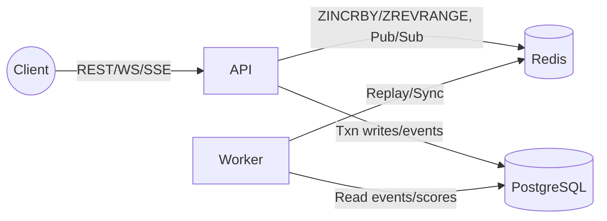
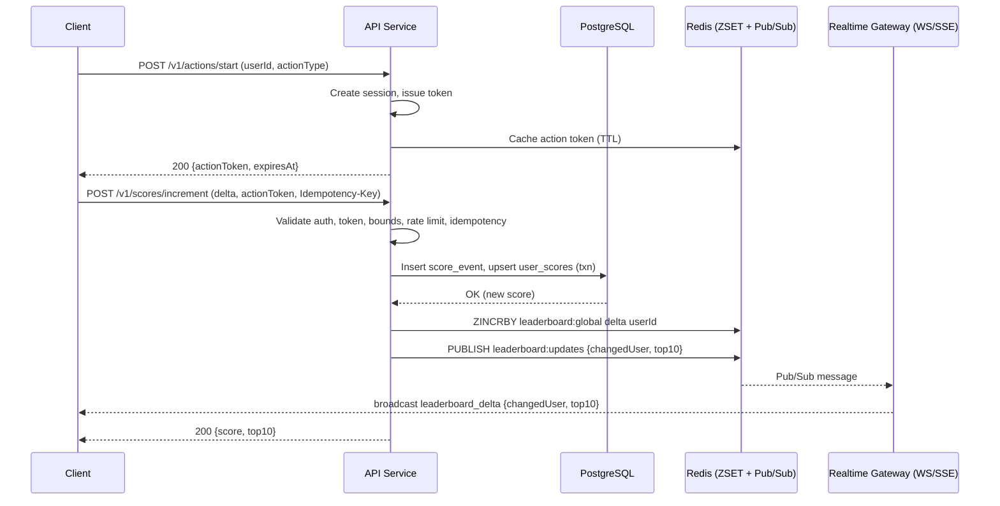

## Real-Time Leaderboard Backend Specification

### Overview
Design and implement a backend service that maintains a real-time leaderboard and exposes secure APIs for updating and reading scores. Users perform an abstract “action”; upon valid completion, their score increases. The service must deliver low-latency reads (top 10) and protect against unauthorized score manipulation.

### Requirements Mapping
- Live top 10 scoreboard shown on the website (R1, R2).
- Completing an action increases the user’s score (R3, R4).
- Prevent malicious score increments; enforce authorization and validation (R5).
- Documentation includes a diagram and improvement notes; hand-off for backend team.

### Goals
- Secure, server-authoritative score updates with verifiable proofs.
- Fast, consistent reads for the top leaderboard (p95 < 50ms under load).
- Durable writes with recovery and replay capability.

### Non-Goals
- Define the business details of the “action” itself.
- Implement the website UI; focus on backend APIs and real-time streams.

### Architecture
- API Service (Node.js/TypeScript; Express or Fastify) for REST and WS/SSE endpoints.
- Redis for:
  - Sorted-set leaderboard (ZSET) for `ZINCRBY` updates and `ZREVRANGE` reads.
  - Pub/Sub channel broadcasting leaderboard deltas.
  - Caching short-lived action tokens.
- PostgreSQL for durability:
  - Append-only `score_events` with idempotency keys.
  - `user_scores` current totals.
  - `action_sessions` to track proof life-cycle.
- Worker process keeps Redis in sync and supports replay on recovery.

#### Component Diagram


### Data Model
- `users(id, display_name, avatar_url?, created_at, updated_at)`
- `action_sessions(id, user_id, action_type, status, started_at, expires_at)`
- `score_events(id, user_id, delta, source, action_session_id, idempotency_key, created_at)`
- `user_scores(user_id, score, updated_at)`

Example DDL:
```sql
CREATE TABLE IF NOT EXISTS users (
  id TEXT PRIMARY KEY,
  display_name TEXT NOT NULL,
  avatar_url TEXT NULL,
  created_at TIMESTAMPTZ NOT NULL DEFAULT NOW(),
  updated_at TIMESTAMPTZ NOT NULL DEFAULT NOW()
);

CREATE TABLE IF NOT EXISTS action_sessions (
  id UUID PRIMARY KEY,
  user_id TEXT NOT NULL REFERENCES users(id),
  action_type TEXT NOT NULL,
  status TEXT NOT NULL CHECK (status IN ('started','completed','expired')),
  started_at TIMESTAMPTZ NOT NULL DEFAULT NOW(),
  expires_at TIMESTAMPTZ NOT NULL
);

CREATE TABLE IF NOT EXISTS score_events (
  id UUID PRIMARY KEY,
  user_id TEXT NOT NULL REFERENCES users(id),
  delta INT NOT NULL,
  source TEXT NOT NULL,
  action_session_id UUID NOT NULL REFERENCES action_sessions(id),
  idempotency_key TEXT NOT NULL UNIQUE,
  created_at TIMESTAMPTZ NOT NULL DEFAULT NOW()
);

CREATE TABLE IF NOT EXISTS user_scores (
  user_id TEXT PRIMARY KEY REFERENCES users(id),
  score BIGINT NOT NULL DEFAULT 0,
  updated_at TIMESTAMPTZ NOT NULL DEFAULT NOW()
);

CREATE INDEX IF NOT EXISTS idx_score_events_user ON score_events(user_id);
CREATE INDEX IF NOT EXISTS idx_users_display_name_ilike ON users ((lower(display_name)));
```

### APIs

#### Authentication & Authorization
- Bearer JWT tokens with scopes: `scores:write` and/or `scores:read`.
- Claims: `sub` (userId), `scope`, standard `exp/iath/iss`.
- Optional HMAC-signed service tokens for server-side producers.

#### Idempotency
- All write endpoints accept `Idempotency-Key` header.
- Store first successful response for 24h, return same on retries.

#### Rate Limiting
- Token bucket per-user and per-IP (e.g., 10 req/s, burst 50). Block and return `429` when exceeded.

#### POST /v1/actions/start
Purpose: Start an action session and return a short-lived action token.
Auth: `scores:write`.
Body:
```json
{ "userId": "string", "actionType": "quiz|game|challenge", "metadata": { "client": "web|ios|android" } }
```
Behavior:
- Validate auth; ensure no active session.
- Create session, expiring in 5 minutes.
- Issue action token (JWT; exp ~2 minutes) with claims: `sub`, `actionSessionId`, `actionType`, `exp`.
- Cache token in Redis with TTL.
Response:
```json
{ "actionSessionId": "uuid", "actionToken": "jwt", "expiresAt": "ISO-8601", "actionType": "quiz" }
```

#### POST /v1/scores/increment
Purpose: Increase user score after valid action completion.
Auth: `scores:write`, `sub` must match `userId` unless privileged service.
Body:
```json
{ "userId": "string", "delta": 1, "actionToken": "jwt", "metadata": { "actionType": "string", "client": "web" } }
```
Behavior:
- Validate scope/subject; bounds check `delta` (1..100 configurable).
- Verify `actionToken` signature and expiration; session status must be `started`.
- Write durable `score_events` (idempotent via `Idempotency-Key`).
- Upsert `user_scores` (`score = score + delta`) in a transaction.
- Mark session `completed`.
- `ZINCRBY` Redis ZSET: `leaderboard:global`.
- Publish update on `leaderboard:updates` with changed user and top-10 snapshot.
Response:
```json
{ "userId": "string", "score": 1234, "leaderboardTop": [ { "userId": "u1", "score": 222 } ] }
```

#### GET /v1/leaderboard/top?limit=10
Purpose: Read top N users by score (default 10, max 100).
Auth: `scores:read`.
Behavior: Read Redis ZSET (`ZREVRANGE ... WITHSCORES`); fallback to DB if empty. Optionally enrich with `displayName` and `avatarUrl` by joining `users` when configured.
Response:
```json
{ "top": [ { "userId": "u1", "score": 222 } ], "lastUpdatedAt": "ISO-8601" }
```

#### GET /v1/realtime/leaderboard (WebSocket) or /v1/stream/leaderboard (SSE)
Purpose: Subscribe to real-time updates.
Auth: `scores:read`.
On connect: send top-10 snapshot; then stream deltas.
Message example:
```json
{ "type": "leaderboard_delta", "changedUser": { "userId": "u42", "score": 513 }, "top": [ ... ] }
```

### Error Semantics
- 400 invalid request (bounds, schema).
- 401 unauthorized; 403 forbidden scope/subject mismatch.
- 409 conflict (active session exists).
- 429 rate limit exceeded.
- 500 internal error; 503 degraded when policy dictates.

### Security & Anti-Abuse
- Server-authoritative scoring; never trust client increments directly.
- Short-lived action tokens cached in Redis; revoke/expire strictly.
- Idempotency on writes; exactly-once effect per key.
- Per-user/IP rate limits; anomaly detection for bursts.
- Optional daily caps and total bounds.
- Audit trail: append-only `score_events`.

### Real-Time Strategy
- On success: update ZSET, compute top-10, publish delta.
- WS/SSE gateway subscribes and broadcasts; new subscribers receive initial snapshot.
- Reconnection: resume with latest snapshot; optionally include sequence IDs.

### Failure & Recovery
- Redis down: accept DB writes; enqueue recovery; serve last-known leaderboard or degrade.
- DB down: fail writes; never update Redis alone.
- Cold start: rebuild ZSET from `user_scores` or replay `score_events`.

### Observability
- Metrics: QPS, p95 latency, Redis/DB latencies, pub/sub lag, connected clients, fan-out time.
- Logs: structured JSON with IDs (`idempotencyKey`, `userId`, `actionType`).
- Tracing: end-to-end across API, worker, Redis, DB.

### Configuration
- Env vars: `REDIS_URL`, `DB_URL`, `ACTION_TOKEN_TTL`, `SESSION_TTL`, rate limits, delta bounds.
- Keys/Channels: `leaderboard:global`, `leaderboard:updates`.

### Sequence Diagram


### Test Plan
- Unit: token validation, idempotency, bounds, rate limits.
- Integration: write → Redis updated → Pub/Sub → WS client receives.
- Chaos: kill Redis/DB; verify behavior and recovery.
- Load: target p95 latency < 50ms at 1k rps with Redis hot.

### Improvement Notes
- Use a dedicated keyspace per leaderboard (global/season/region) for isolation.
- Periodic ZSET snapshots to DB for faster cold starts.
- Signed snapshots for tamper evidence.
- Batch enrichments (names/avatars) via a profile service.
- Consider queue-based workers (Kafka/RabbitMQ) for high QPS to decouple writes from broadcast.
